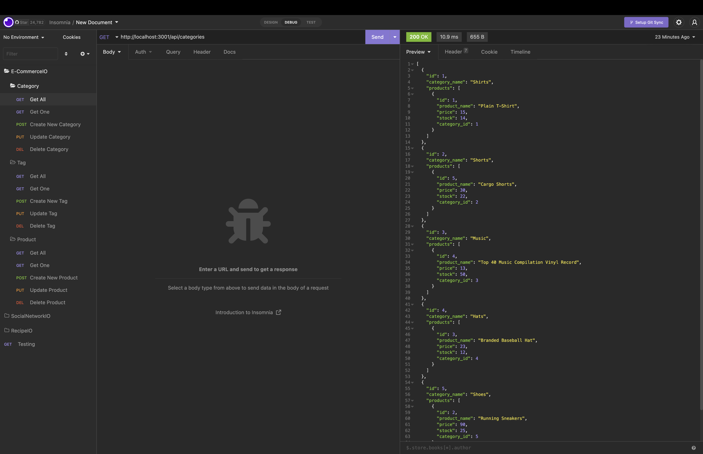

# E-CommerceIO

## Description

What was my motivation?

- To clearly display and edit data from a database

Why did I build this project?

- I built this project to better understand sequelize, express, and mysql2

What problem does it solve?

- To create an database that contains table that can be created, updated, and deleted. As well as have a way to connect two tables using a junction table

What did I learn?

- I learned how to create a junction table and be able to update and delete items using sequelize and express

## Table of Contents

- [Installation](#installation)
- [Usage](#usage)
- [Contributing](#contributing)
- [Tests](#tests)
- [Questions](#questions)
- [License](#license)

## Installation

1: Create a ".env" file within the folder and set DB_Name to 'econmmerce_db' and input your mysql username and password.
2: Go into the terminal and log into mysql by typing "mysql -u root -p" and then insert your password
3: Type "SOURCE db/schema.sql" to delete the database if already created and then recreate it, then type "exit" to exit mysql
4: Then type "npm i" to install all required dependencies
5: Then type "npm run watch" to start the application.
6: You can then go into Insomnia to check all the GET routes as well as POST, PUT, and DELETE.
7: Link to walkthrough is below

## Usage

## Contributing

No collaborators

## Tests

No Tests

## Questions

Github Profile: josephpicardat

If you need to reach me, you can with through my email: josephpicardat1@gmail.com

## License

(https://opensource.org/licenses/MIT)

Copyright 2022 Joseph Picardat

Permission is hereby granted, free of charge, to any person obtaining a copy of this software and associated documentation files (the "Software"), to deal in the Software without restriction, including without limitation the rights to use, copy, modify, merge, publish, distribute, sublicense, and/or sell copies of the Software, and to permit persons to whom the Software is furnished to do so, subject to the following conditions:

    The above copyright notice and this permission notice shall be included in all copies or substantial portions of the Software.

    THE SOFTWARE IS PROVIDED "AS IS", WITHOUT WARRANTY OF ANY KIND, EXPRESS OR IMPLIED, INCLUDING BUT NOT LIMITED TO THE WARRANTIES OF MERCHANTABILITY, FITNESS FOR A PARTICULAR PURPOSE AND NONINFRINGEMENT. IN NO EVENT SHALL THE AUTHORS OR COPYRIGHT HOLDERS BE LIABLE FOR ANY CLAIM, DAMAGES OR OTHER LIABILITY, WHETHER IN AN ACTION OF CONTRACT, TORT OR OTHERWISE, ARISING FROM, OUT OF OR IN CONNECTION WITH THE SOFTWARE OR THE USE OR OTHER DEALINGS IN THE SOFTWARE.
